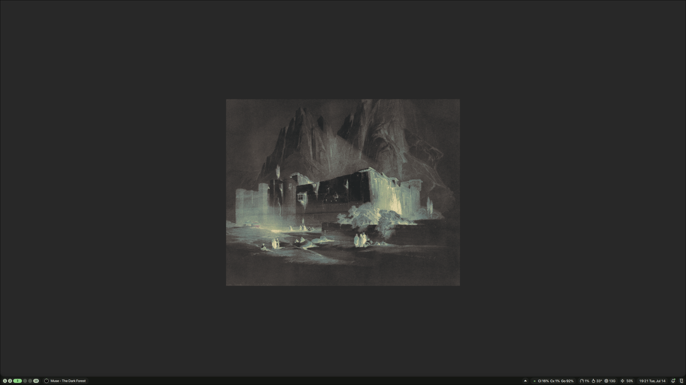
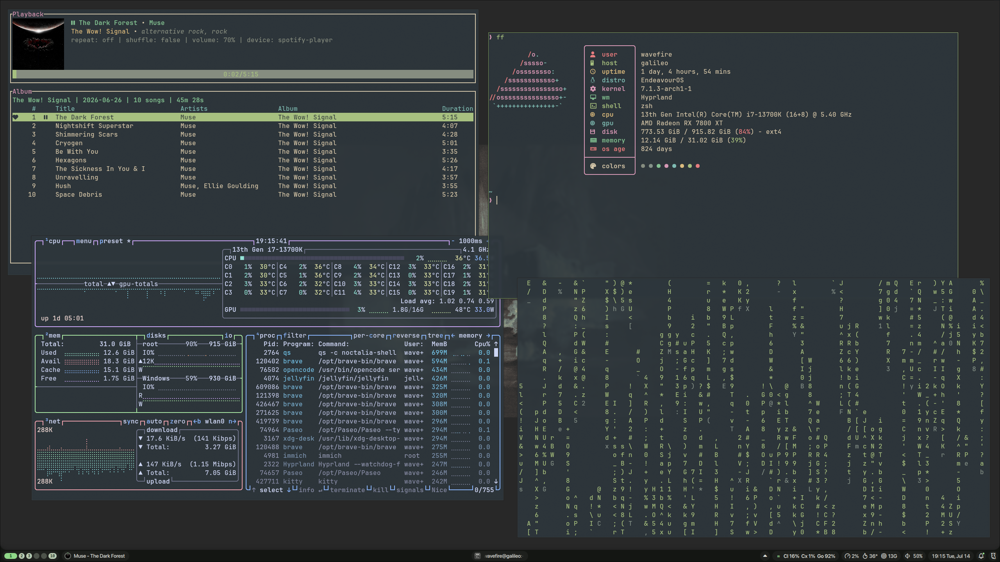
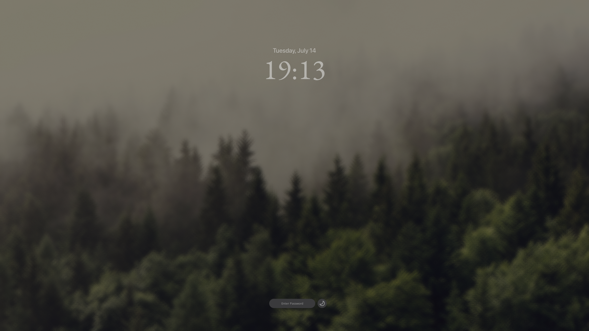

# dotfiles

my first rice with hyprland, going for a minimalistic style.

this dotfiles repo is managed with [chezmoi](https://github.com/twpayne/chezmoi).

## showcase

<!--
## To-Do

- ~~Improve screenshot workflow (edit after screenshot)~~
- ~~Improve tray in waybar (bluetooth icon etc)~~
- ~~Configure swaync~~
- ~~Configure hypridle~~
- ~~Configure hyprlock~~
- ~~Configure wlogout~~
- ~~Seperate sections in hyprland.conf into different files~~
- ~~Configure rofi~~
  - ~~rofi-emoji~~
  - rofi-calc
- Make scripts for rofi
-->

## useful links and snippets

[hyprland-and-ssh-agent](https://www.lorenzobettini.it/2023/09/hyprland-and-ssh-agent/)
